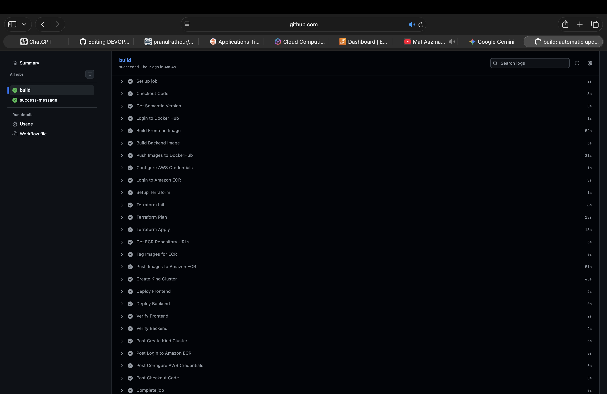
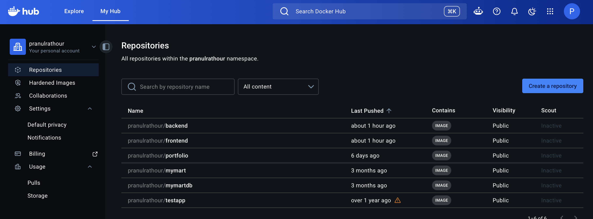
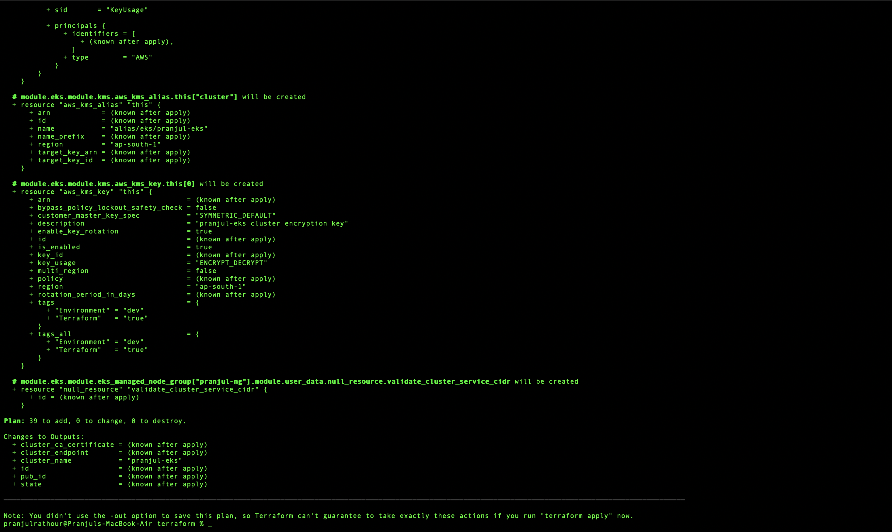
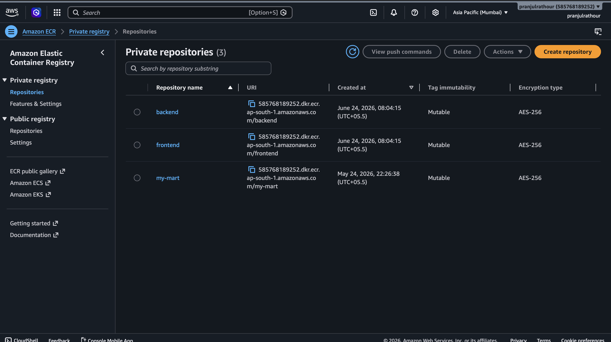
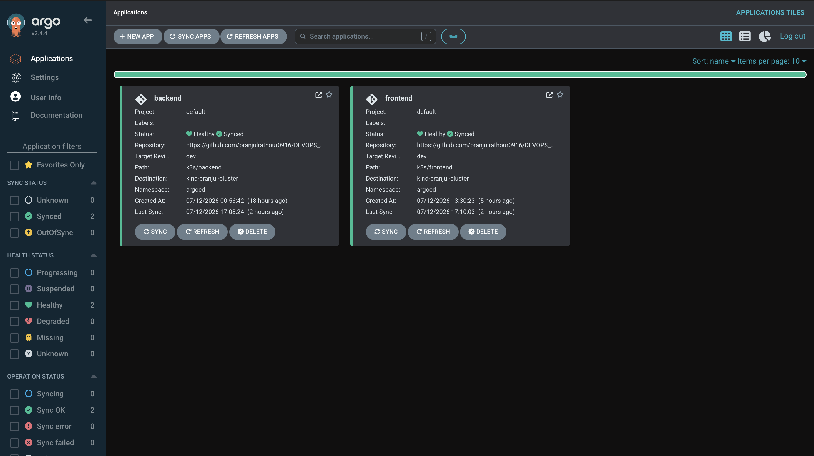
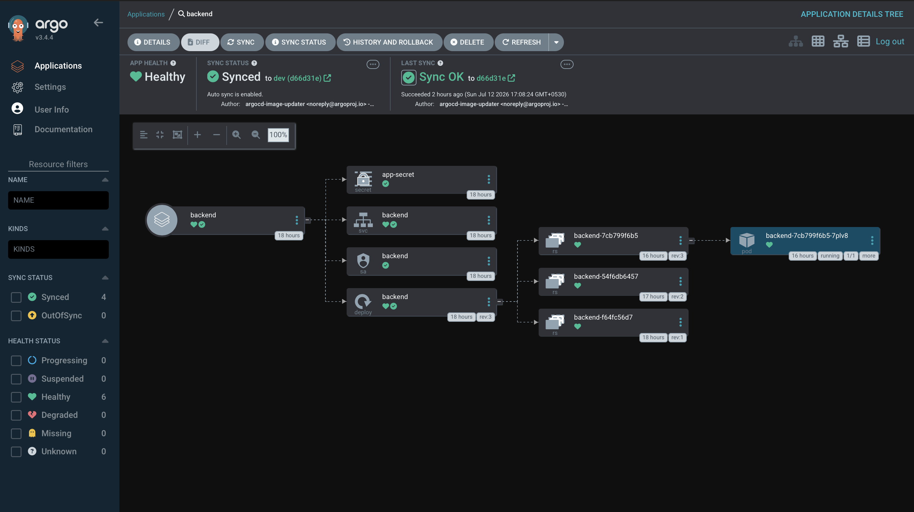
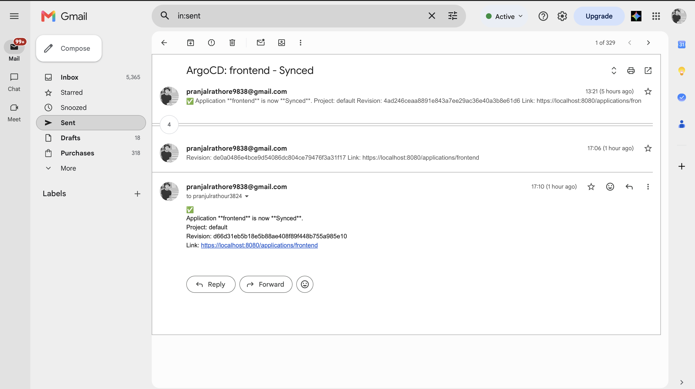
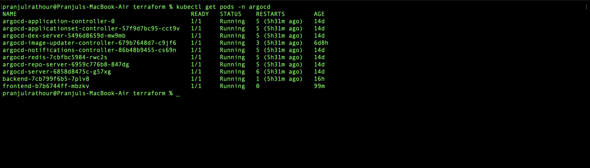
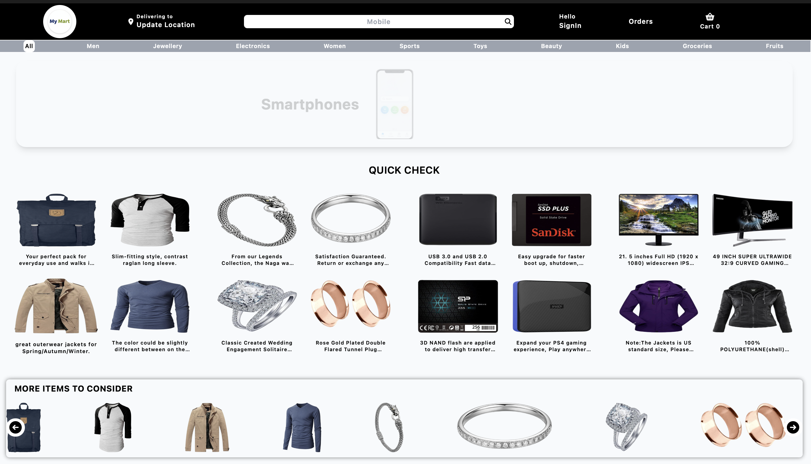
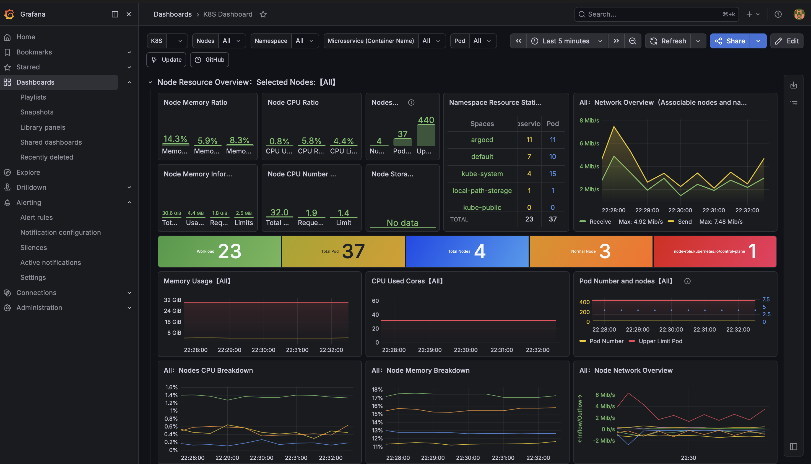

# 🛒 My Mart – End-to-End DevOps GitOps Deployment Pipeline


## 📖 Overview

**My Mart** is a complete DevOps project that demonstrates an end-to-end CI/CD and GitOps workflow for deploying a containerized application on Kubernetes.

The project automates:

- Application Versioning
- Docker Image Build
- DockerHub Publishing
- Infrastructure Provisioning using Terraform
- Amazon ECR Integration
- Kubernetes Deployment using Helm
- GitOps Continuous Delivery using ArgoCD
- Automatic Image Updates
- Deployment Notifications
- Rollback on Failure

---

# 🏗 Project Architecture

```
Developer
    │
    ▼
Git Push (dev branch)
    │
    ▼
GitHub Actions
    │
    ├── Checkout Source
    ├── Generate Semantic Version
    ├── Build Docker Images
    ├── Push Images to DockerHub
    ├── Provision AWS Infrastructure (Terraform)
    ├── Create ECR Repositories
    ├── Push Images to Amazon ECR
    ├── Deploy using Helm
    └── Verify Deployment
                │
                ▼
         Kubernetes Cluster
                │
                ▼
             ArgoCD
                │
        Image Updater
                │
                ▼
      Automatic Application Sync
                │
                ▼
        ArgoCD Notifications
```

---

# 🚀 Features

- GitHub Actions CI/CD Pipeline
- Automatic Semantic Versioning
- Multi-container Docker Build
- DockerHub Integration
- Amazon ECR Integration
- Infrastructure as Code using Terraform
- Kubernetes Deployment
- Helm Charts
- GitOps using ArgoCD
- ArgoCD Image Updater
- ArgoCD Notifications
- Automatic Rollback using Helm
- Kubernetes Rollout Verification

---

# 🛠 Tech Stack

| Category | Technology |
|----------|------------|
| Source Control | Git, GitHub |
| CI/CD | GitHub Actions |
| Containers | Docker |
| Registry | DockerHub |
| Cloud | AWS |
| Container Registry | Amazon ECR |
| IaC | Terraform |
| Orchestration | Kubernetes |
| Package Manager | Helm |
| GitOps | ArgoCD |
| Notifications | ArgoCD Notifications |
| Auto Image Updates | ArgoCD Image Updater |

---

# 📂 Repository Structure

```
.
├── .github/
│   └── workflows/
│       └── deploy.yml
│
├── My-Mart/
│   ├── dockerfile
│   └── ...
│
├── martdb/
│   ├── dockerfile
│   └── ...
│
├── terraform/
│   ├── main.tf
│   ├── variables.tf
│   ├── outputs.tf
│   └── providers.tf
│
├── k8s/
│   ├── frontend/
│   └── backend/
│
└── README.md
```

---

# ⚙ CI/CD Pipeline

## 1. Source Checkout

The pipeline checks out the complete repository history.

---

## 2. Semantic Versioning

The workflow automatically generates the next semantic version.

Example:

```
v1.0.0

↓

v1.0.1

↓

v1.0.2
```

---

## 3. Docker Image Build

Builds

- Frontend Image
- Backend Image

Images are tagged with

- Latest
- Semantic Version

Example

```
frontend:v1.2.0
frontend:latest

backend:v1.2.0
backend:latest
```

---

## 4. DockerHub Push

Images are pushed to DockerHub.

**Screenshot**

```
docs/dockerhub.png
```

---

## 5. Terraform Deployment

Terraform automatically provisions AWS infrastructure including:

- Amazon ECR Repositories
- IAM Resources (if configured)
- Networking Resources (optional)

---

## 6. Amazon ECR Push

Docker images are re-tagged and pushed to Amazon ECR.

---

## 7. Helm Deployment

Applications are deployed using Helm charts.

Example:

```
helm upgrade --install frontend

helm upgrade --install backend
```

---

## 8. Deployment Verification

Deployment status is verified using

```
kubectl rollout status
```

---

## 9. Automatic Rollback

Helm supports automatic rollback using:

```
helm upgrade \
    --install \
    --atomic \
    --wait \
    --timeout 5m
```

If deployment fails:

```
Deploy New Version

        │

        ▼

Pods Become Ready?

     YES      NO

      │        │

      ▼        ▼

 Success   Automatic Rollback
```

---

# 🔄 GitOps Workflow

```
GitHub

      │

      ▼

GitHub Actions

      │

      ▼

DockerHub

      │

      ▼

Amazon ECR

      │

      ▼

ArgoCD Image Updater

      │

      ▼

Git Repository Updated

      │

      ▼

ArgoCD Sync

      │

      ▼

Kubernetes
```

---

# 🔔 ArgoCD Notifications

The project automatically sends deployment notifications whenever:

- Application Sync succeeds
- Deployment fails
- Health status changes

---

# 🔁 Automatic Image Updates

ArgoCD Image Updater continuously monitors the image registry.

Whenever a new image is pushed:

```
Docker Push

      │

      ▼

Image Updater

      │

      ▼

Update Git Repository

      │

      ▼

ArgoCD Sync

      │

      ▼

Application Updated
```

---

# 📸 Screenshots

## GitHub Actions

<p align="center">
  
</p>

---

## DockerHub

<p align="center">
  
</p>

---

## Terraform Apply

<p align="center">
  
</p>

---

## Amazon ECR

<p align="center">
  
</p>

---

## ArgoCD Dashboard

<p align="center">
  
</p>

---

## Image Updater

<p align="center">
  
</p>

---

## Notifications

<p align="center">
  
</p>

---

## Kubernetes Pods

<p align="center">
  
</p>

---

## Running Application

<p align="center">
  
</p>

## Monitorinig Grafana

<p align="center">
  
</p>

# ▶ Running Locally

Clone the repository

```bash
git clone https://github.com/pranjulrathour0916/DEVOPS_PROJECT.git
```

Build Docker images

```bash
docker build -t frontend ./My-Mart

docker build -t backend ./martdb
```

Deploy Infrastructure

```bash
cd terraform

terraform init

terraform apply
```

Deploy Helm Charts

```bash
cd k8s

helm upgrade --install frontend ./frontend

helm upgrade --install backend ./backend
```

Verify

```bash
kubectl get pods -n app
```

---

# 🔐 GitHub Secrets

Configure the following GitHub Secrets.

| Secret |
|----------|
| AWS_ACCESS_KEY |
| AWS_SECRET_KEY |
| DOCKER_USERNAME |
| DOCKER_PASSWORD |

---

# 📈 Future Improvements

- Trivy Security Scanning
- SBOM Generation
- Cosign Image Signing
- Helm Lint
- Terraform Validation
- Kubernetes Manifest Validation
- Prometheus Monitoring
- Grafana Dashboards
- Loki Logging
- Automated GitHub Releases

---

# 👨‍💻 Author

Your Name

GitHub: https://github.com/pranjulrathour0916

LinkedIn: https://www.linkedin.com/in/pranjul-rathour-259645204

---

# ⭐ Support

If you found this project helpful, consider giving it a ⭐ on GitHub.